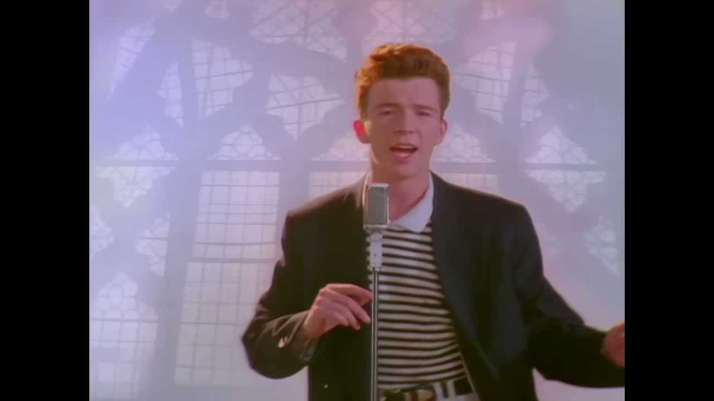

# ctxr

<picture>
  <source media="(prefers-color-scheme: dark)" srcset="https://raw.githubusercontent.com/mukulchugh/ctxr/e32c25446ea3dcf5aac1002049b666b302c3acfc/assets/banner.png">
  <source media="(prefers-color-scheme: light)" srcset="https://raw.githubusercontent.com/mukulchugh/ctxr/e32c25446ea3dcf5aac1002049b666b302c3acfc/assets/banner-light.png">
  
</picture>

**Context from video, for agents.**

[Install](#install) · [Usage](#usage) · [Agent setup](#use-it-from-an-agent) · [Brand assets](assets/README.md)

ctxr turns YouTube videos into Markdown walkthroughs for AI agents. It keeps the frames where the screen changes and pairs each one with the words spoken while it was on screen.

Give it a product demo, tutorial, talk, playlist, or page of embedded videos. You get timestamped frames, a transcript, and an index an agent can read and cite.

## Quick start

```
uv tool install "ctxr[whisper,mcp] @ git+https://github.com/mukulchugh/ctxr"
ctxr --page https://example.com/product/demos --out ./demos
```

One command finds every video embedded on the page and produces a folder per video:

```
demos/
  README.md                 how to read this folder (written for an agent)
  INDEX.md                  one row per video: date, title, length, frames, transcript source
  ALL-DEMOS.md              every walkthrough joined into one file for single-shot ingestion
  2026-09-15-comments-on-dashboards-VIDEOID/
    README.md               the walkthrough
    manifest.json           frames with the transcript segments aligned under each
    transcript.json .srt .txt
    info.json               title, channel, date, duration, description, tags
    frames/0007_01m23s.jpg  1280px frames, one per visible screen change
```

## A moment of video, as text

The banner uses a real frame and transcript excerpt from the original Rickroll. This is the same pairing ctxr writes into a walkthrough; the timestamp links back to the video.

### 01:40 ([watch](https://www.youtube.com/watch?v=dQw4w9WgXcQ&t=100))



> Never gonna give you up

[Sample provenance and extraction details](assets/source/sample.json)

## Install

Requires Python 3.10+ and `ffmpeg` on your PATH (`brew install ffmpeg` or `apt install ffmpeg`).

```
uv tool install "ctxr @ git+https://github.com/mukulchugh/ctxr"               # captions from YouTube only
uv tool install "ctxr[whisper] @ git+https://github.com/mukulchugh/ctxr"      # plus local transcription for videos without usable captions
uv tool install "ctxr[whisper,mcp] @ git+https://github.com/mukulchugh/ctxr"  # plus the MCP server (ctxr-mcp)
```

Or run it without installing: `uvx --from "ctxr @ git+https://github.com/mukulchugh/ctxr" ctxr <url>`. ctxr is installed from this repository; there is no PyPI package.

## Usage

```
ctxr https://youtu.be/VIDEOID                           # one video
ctxr --playlist https://www.youtube.com/playlist?list=… # every video in a playlist or channel
ctxr --page https://example.com/product/demos           # every YouTube video embedded on a page
ctxr --page URL --out ./docs --limit 5                  # try the first five first
```

Options:

| Flag | Default | What it does |
|---|---|---|
| `--out DIR` | `./ctxr-out` | Where the folders go |
| `--scene 0.05` | 0.05 | Scene-change threshold, 0 to 1. Lower means more frames. 0.05 suits screen recordings |
| `--min-gap 10` | 10 | Also take a frame at least this many seconds apart, so slow stretches are still covered |
| `--every N` | off | Fixed grid every N seconds instead of scene detection |
| `--whisper-all` | off | Transcribe locally even when YouTube captions exist (cleaner punctuation) |
| `--cooldown 5` | 5 | Pause after each video. See rate limits below |
| `--proxy URL` | off | HTTP, HTTPS or SOCKS proxy for yt-dlp and the caption client, for example a rotating residential gateway |
| `--keep-video` | off | Keep the downloaded mp4 next to the frames |
| `--force` | off | Redo folders that already have a manifest |
| `--self-test` | | Run the built-in check and exit |

A folder that already has `manifest.json` is skipped, so an interrupted batch resumes where it stopped.

## How it works

1. **Find the videos.** `--page` fetches the page and pulls every YouTube id out of `watch?v=`, `youtu.be/`, `/embed/` and `i.ytimg.com/vi/` thumbnail links, in page order. `--playlist` asks yt-dlp for the flat list.
2. **Download.** yt-dlp fetches a 720p mp4 and the metadata JSON. The mp4 is deleted after the frames are cut unless you pass `--keep-video`.
3. **Transcript.** English captions come back in the same yt-dlp call as json3, so most videos cost no extra requests. If none were written, youtube-transcript-api is asked once; after the first block from YouTube it is not asked again for the rest of the run. If there are still no captions, or you pass `--whisper-all`, ffmpeg extracts 16 kHz mono audio and faster-whisper (small model, runs locally) transcribes it. The manifest records which source was used: `youtube`, `youtube-transcript-api` or `whisper-small`.
4. **Frames.** One ffmpeg pass with a scene-change filter, a 1.5 second debounce so a transition does not produce a burst, and a floor of one frame every `--min-gap` seconds. Frame count scales with how much the picture changes, not with frame rate.
5. **Align.** Each transcript segment is placed under the last frame shown at or before the segment starts.
6. **Write.** README.md, manifest.json, transcript files per video, then INDEX.md, ALL-DEMOS.md and an agent-facing README.md at the root.

## Rate limits

YouTube publishes no limits for these endpoints, but it rate-limits quickly. In one 73-video run from a home connection, caption requests started failing after about 17 videos in 5 minutes and downloads returned 403 every 10 videos or so. ctxr therefore runs yt-dlp with its own `-t sleep` preset (a 10 to 20 second random pause before each download, 0.75 seconds between requests), pauses `--cooldown` seconds after each video, fetches captions inside the download call instead of through a second client, stops asking the caption endpoint after the first block, and on a failed download backs off 15, 45 and 90 seconds on the default player client (the ios and android clients need a PO token, so switching to them only wastes the wait). With those settings the rest of that run finished with zero failures, at about one video per minute. If you need YouTube's own captions at a scale where one IP is not enough, pass `--proxy` with a rotating residential gateway; datacenter proxies, cloud IPs and Tor are blocked outright.

A source-backed write-up of what blocks, what works, what it costs and where the terms of service stand is in [docs/RATE-LIMITS.md](docs/RATE-LIMITS.md).

## Teaching an agent with the output

The root README.md tells an agent how to read the folder. A ready-to-use prompt is in [docs/AGENT-PROMPT.md](docs/AGENT-PROMPT.md). The short version: read INDEX.md, then each walkthrough in date order, treat the frames as ground truth for the UI and the narration as the explanation, and cite the video and timestamp for anything specific.

## Use it from an agent

ctxr ships as an MCP server and as a skill, so an agent can run the whole workflow itself and then query the result in small pieces instead of reading 400 KB of Markdown.

**MCP tools** (`ctxr-mcp`, stdio): `ctxr_process` (ids, a playlist, or every video on a page; `background: true` for big batches), `ctxr_status`, `ctxr_index`, `ctxr_search` (where is X said, with the frame on screen and a link to that second), `ctxr_walkthrough` (one video, section by section, with a time window), `ctxr_frame` (the screen at second t, as an image), and a `learn_from_videos` prompt. Design notes: [docs/MCP.md](docs/MCP.md).

Claude Code, as a plugin (skill + MCP server together):
```
/plugin marketplace add mukulchugh/ctxr
/plugin install ctxr@ctxr
```

Codex, in `~/.codex/config.toml`:
```toml
[mcp_servers.ctxr]
command = "uvx"
args = ["--from", "ctxr[mcp,whisper] @ git+https://github.com/mukulchugh/ctxr", "ctxr-mcp"]
```

Cursor, in `~/.cursor/mcp.json` (Claude Code accepts the same block in a project `.mcp.json`):
```json
{ "mcpServers": { "ctxr": { "type": "stdio", "command": "uvx",
  "args": ["--from", "ctxr[mcp,whisper] @ git+https://github.com/mukulchugh/ctxr", "ctxr-mcp"] } } }
```

The skill alone, into Claude Code, Codex, Cursor and other Agent Skills clients:
```
npx skills add mukulchugh/ctxr
```

The output folder for MCP calls is `out` per call, else `$CTXR_OUT`, else `~/ctxr`.

## Limits

- Captions are automatic (YouTube or Whisper), so product names can be misheard. The frames are the ground truth for UI labels.
- A short burst of screen changes can produce frames with no narration under them. They are kept and marked, because the frame usually shows the result of the previous action.
- Only YouTube for now. Local files and other platforms are a small change away since everything after the download is source-agnostic.

## Brand assets

[Wordmark SVG](assets/logo.svg) · [Dark-background wordmark](assets/logo-dark.svg) · [Social preview](assets/social-preview.png) · [App icon](assets/icon.png)

The [asset guide](assets/README.md) includes light and dark banners, PNG exports, favicons, palette, typography, and reproduction instructions.

## License

[MIT](LICENSE). Azeret Mono uses the [SIL Open Font License 1.1](assets/FONT-LICENSE.txt). The video frame and lyric remain third-party material and are excluded from the MIT license. See the [asset guide](assets/README.md#authentic-sample-and-rights).
