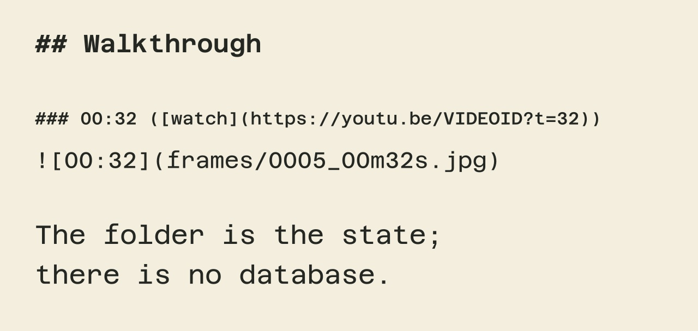

# ctxr output example

- YouTube: https://youtu.be/VIDEOID
- Channel: 
- Published: 
- Duration: 00:00
- Transcript source: illustrative narration
- Frames: 1

## Description

_(none)_

## Walkthrough

Each frame is followed by what is being said while it is on screen.

### 00:32 ([watch](https://youtu.be/VIDEOID?t=32))

The folder is the state; there is no database.
